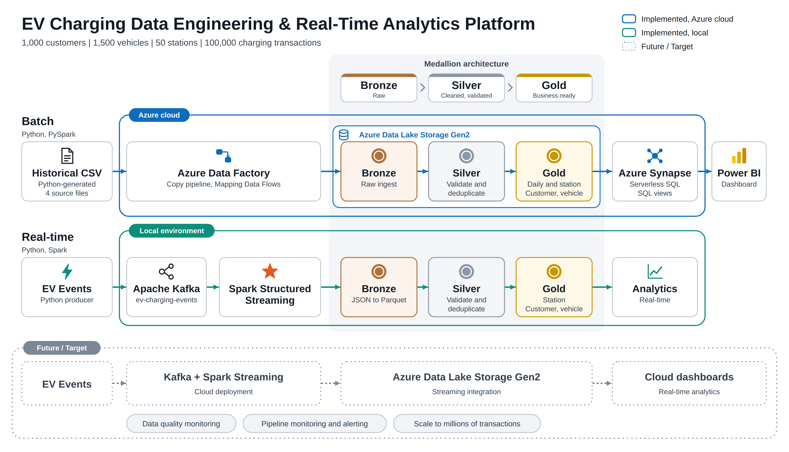
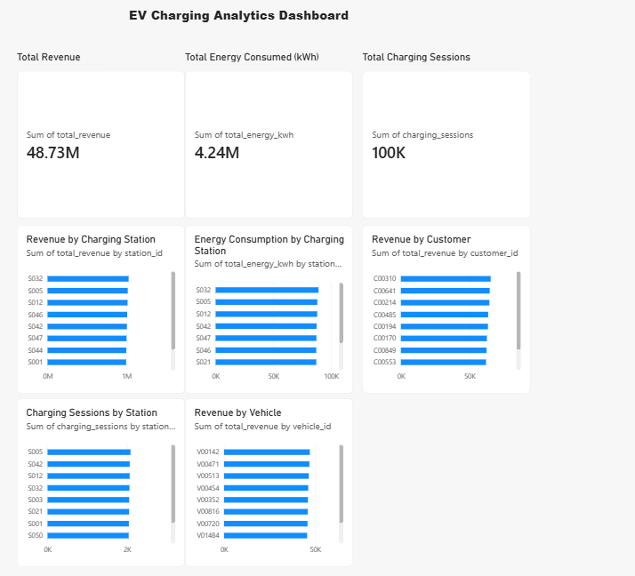

# EV Charging Data Engineering & Real-Time Analytics Platform

An end-to-end data engineering platform for processing historical and real-time electric vehicle (EV) charging data.

This project demonstrates batch processing, real-time streaming, data quality, medallion architecture, analytics, and cloud data engineering using PySpark, Apache Kafka, and Microsoft Azure services.

## Project Objective

Build a scalable data platform that processes EV charging data and provides analytics on:

- Energy consumption
- Charging revenue
- Station utilization
- Customer charging behavior
- Vehicle charging behavior
- Charging demand

## Architecture

The platform consists of two complementary data pipelines.

### Batch Pipeline

Historical EV charging data is processed through Azure Data Factory and Azure Data Lake Storage Gen2. PySpark is used for data transformation and analytics, while Azure Synapse Serverless SQL provides query access to Gold-layer Parquet data. Power BI consumes the analytics views for visualization.

### Real-Time Pipeline

Real-time EV charging events are generated by a Python producer and published to Apache Kafka. Spark Structured Streaming consumes the Kafka events and processes them through Bronze, Silver, and Gold layers.

The real-time pipeline is currently implemented and tested locally. Cloud deployment of Kafka and Spark Structured Streaming is planned as a future enhancement.



## Technology Stack

- Python - Data generation and scripting
- PySpark - Batch processing and transformations
- Apache Kafka - Real-time event ingestion
- Spark Structured Streaming - Real-time data processing
- Azure Data Factory - Data ingestion and pipeline orchestration
- Azure Data Lake Storage Gen2 - Cloud data storage
- Azure Synapse Analytics - SQL analytics and data serving
- Power BI - Data visualization and dashboards
- Git and GitHub - Version control and project management

## Batch Data Pipeline

The batch pipeline processes historical EV charging transaction data using PySpark and Azure Data Factory.

### Pipeline Flow

Raw CSV Data

↓

Bronze Layer

↓

Silver Layer

↓

Gold Layer

↓

Business Analytics

### Bronze Layer

Raw EV charging transaction data is ingested into the Bronze layer with minimal transformation.

### Silver Layer

The Silver layer performs:

- Data type conversion
- Null-value validation
- Duplicate removal
- Energy validation
- Payment validation
- Timestamp validation
- Charging status validation

### Gold Layer

The Gold layer creates business-ready analytical datasets:

- Daily charging analytics
- Station analytics
- Customer analytics
- Vehicle analytics

### Current Batch Dataset

- Customers: 1,000
- Vehicles: 1,500
- Stations: 50
- Charging Transactions: 100,000

## Real-Time Streaming Pipeline

The real-time pipeline processes EV charging events using Apache Kafka and Spark Structured Streaming.

### Pipeline Flow

EV Charging Events

↓

Kafka

↓

Spark Structured Streaming

↓

Bronze Layer

↓

Silver Layer

↓

Gold Layer

↓

Business Analytics

### Kafka

Apache Kafka is used as the real-time event ingestion layer.

The project uses the Kafka topic:

`ev-charging-events`

Each event contains:

- Transaction ID
- Customer ID
- Vehicle ID
- Station ID
- Start time
- Energy consumed
- Amount paid
- Charging status

### Streaming Bronze Layer

The Bronze streaming pipeline consumes JSON events from Kafka and stores the incoming events as Parquet data.

### Streaming Silver Layer

The Silver streaming pipeline validates incoming events by checking:

- Required IDs are not null
- Energy consumption is greater than zero
- Payment amount is non-negative
- Charging status is valid
- Duplicate transaction IDs are checked

### Streaming Gold Layer

The Gold streaming pipeline generates analytics for:

- Charging stations
- Customers
- Vehicles

## Data Quality

The project applies validation rules to maintain reliable analytical data.

### Batch Data Quality

- Required IDs must not be null
- Energy consumption must be greater than zero
- Payment amount must be non-negative
- Timestamps must be valid
- Duplicate transactions are removed
- Charging status must contain valid values

### Streaming Data Quality

- Required IDs are validated
- Invalid energy values are filtered
- Invalid payment values are filtered
- Invalid charging statuses are filtered
- Duplicate transaction IDs are checked

## Medallion Architecture

The project follows the Medallion Architecture.

- Bronze - Raw ingested data
- Silver - Cleaned and validated data
- Gold - Business-ready analytical data

## Azure Cloud Integration

The batch data engineering pipeline is integrated with Microsoft Azure services.

### Azure Data Lake Storage Gen2

- Stores Bronze, Silver, and Gold data layers
- Raw EV charging datasets are uploaded to the Bronze container
- Processed Parquet data is stored in Silver and Gold containers

### Azure Data Factory

- Ingests data from Bronze into Silver
- Performs Gold-layer transformations using Mapping Data Flows
- Generates analytics datasets for:
  - Daily analytics
  - Station analytics
  - Customer analytics
  - Vehicle analytics

### Azure Synapse Analytics

- Uses the Serverless SQL pool to query Gold-layer Parquet data
- Provides SQL views for Power BI consumption

### Power BI

- Connected to Azure Synapse Serverless SQL
- Provides an interactive EV Charging Analytics Dashboard
- Dashboard includes:
  - Total revenue
  - Total energy consumption
  - Total charging sessions
  - Top 10 stations by revenue
  - Top 10 stations by energy consumption
  - Top 10 stations by charging sessions
  - Top 10 customers by revenue
  - Top 10 vehicles by revenue

  

### Real-Time Cloud Integration

The Kafka and Spark Structured Streaming pipeline is currently implemented and tested locally.

Cloud deployment of the real-time streaming pipeline is planned as a future enhancement.

## Current Implementation

### Batch Data Engineering

- Synthetic EV charging data generation using Python
- PySpark-based Bronze ingestion
- Silver-layer data cleaning and validation
- Gold-layer business analytics using PySpark
- Batch analytics for daily, station, customer, and vehicle-level data

### Real-Time Data Engineering

- Kafka topic for EV charging events
- Python Kafka producer for real-time event generation
- Spark Structured Streaming for Kafka ingestion
- Streaming Bronze, Silver, and Gold processing
- Data quality validation and duplicate handling
- Real-time station, customer, and vehicle analytics

### Azure Cloud

- Azure Data Lake Storage Gen2
- Azure Data Factory pipelines and Mapping Data Flows
- Azure Synapse Serverless SQL
- SQL views over Gold Parquet datasets
- Power BI dashboard connected to Synapse

## Project Structure

```text
EV_Vehicles/
│
├── data/
│   ├── raw/
│   ├── processed/
│   └── output/
│
├── src/
│   ├── data_generation/
│   ├── batch/
│   └── streaming/
│
├── notebooks/
├── tests/
├── config/
│
├── architecture.png
├── README.md
└── .gitignore
```

### Key Analytics

The platform provides analytics for:

- Total energy consumption
- Charging revenue
- Charging sessions
- Station utilization
- Customer charging behavior
- Vehicle charging behavior
- Charging demand

### Future Enhancements

- Deploy Kafka and Spark Structured Streaming to the cloud
- Integrate real-time streaming data with Azure Data Lake Storage Gen2
- Extend real-time analytics to cloud-based dashboards
- Add automated data quality monitoring
- Add pipeline monitoring and alerting
- Scale the synthetic dataset to millions of charging transactions

### Technologies

Python • PySpark • Apache Kafka • Spark Structured Streaming • Azure Data Factory • Azure Data Lake Storage Gen2 • Azure Synapse Analytics • Power BI • Git • GitHub
